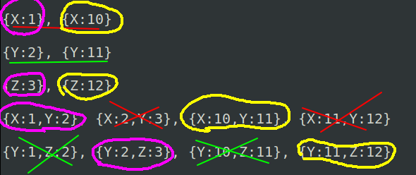

# Example 1

## query

```
background(X),of(X,Y),style(Y),of(Y,Z),button(Z),red(X).
```

## universe

```
background(1),of(1,2),style(2),of(2,3),button(3),red(1),background(10),of(10,11),
style(11),of(11,12),button(12),red(10).
```

```
{x:1},{x:10}
{x:1,y:2},{x:2,y:3},{x:10,y:11},{x:11,y:12}
{y:2},{y:11}
{y:1,z:2},{y:2,z:3},{y:10,z:11}{y:11,z:12}
{z:3},{z:12}
{x:1},{x:10}
```

Rearrange just for simplicity:

```
{x:1},{x:10}
{x:1},{x:10} //duplicate
{y:2},{y:11}
{z:3},{z:12}
{x:1,y:2},{x:2,y:3},{x:10,y:11},{x:11,y:12}
{y:1,z:2},{y:2,z:3},{y:10,z:11}{y:11,z:12}
```



---

# Example 2


## query

```
background(X),of(X,Y),style(Y),of(Y,Z),button(Z),red(X).
```

## universe

```
background(1),of(1,2),style(2),of(2,3),button(3),red(1),background(10),of(10,11),
style(11),of(11,12),button(12),green(10).
```

```
{x:1},{x:10}
{x:1,y:2},{x:2,y:3},{x:10,y:11},{x:11,y:12}
{y:2},{y:11}
{y:1,z:2},{y:2,z:3},{y:10,z:11}{y:11,z:12}
{z:3},{z:12}
{x:1}
```
