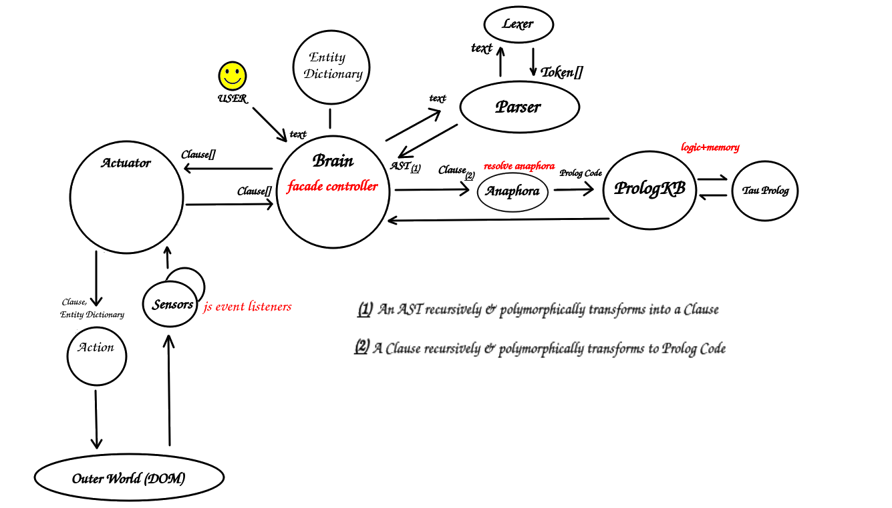
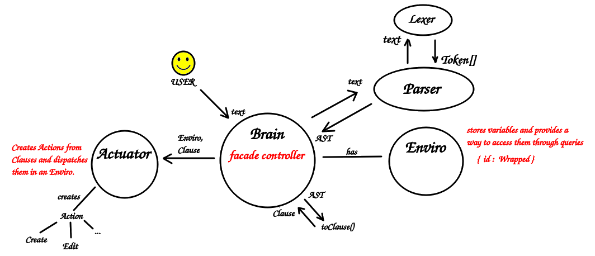

# Prolog Approach

The first "tracer bullet" <!-- link to pragmatic programmer --> had at its core [Tau Prolog](http://tau-prolog.org/), an opensource Javascript implementation of Prolog. This is a high-level overview of the architecture that was employed:

## How it worked

In summary, the Brain (a facade controller) received "natural language" sentences from the user, and called the Parser, which returned an AST (Abstract Syntax Tree). The AST was recursively converted into a "Clause" (a language-agnostic representation of the equivalent predicate logic), which could in turn be converted into (one or more) valid PrologClauses, to be fed to the Prolog engine. 

<!-- link to SWORIER for limitations of Prolog syntax -->

The state of the system was centralized in the Brain, more specifically: in a Prolog object in the Brain, which provided a dynamic knowledge base. New assertions by the user could contain anaphora (references to pre-existing entities) which where resolved by a dedicated class (Anaphora) through a specific algorithm.
<!-- link to theme-rheme -->

Once new knowledge was asserted in the Brain, the Brain made a "diff" of the old versus the new pieces of knowledge for each single entity, and "pushed" the changes downstream to the Actuator. Each entity was identified by a unique global ID, and each ID had a corresponding Javascript object in the Entity Dictionary.

<!-- link to React reconciliation algorithm -->

The Actuator converted Clauses to Actions, which could run in an asynchronous fashion (waiting for a required but not yet initialized object if need be). These Actions actually produced the required effect in the underlying javascript environment, like creating a button or changing its color.

## Naturalistic Features

The system supported general statements (eg: "every button is red"), through the use of the universal quantifier (implemented as one or more Horn Clauses in Prolog). The system also supported anaphora ("the green button ...").

Support for general statements (or "dynamic sets"), alongside with anaphora, is held to be a highly expressive feature of natural languages, that could be profitably imitated in programming languages.

<!-- link to paper: "beyond AOP" -->

## Problems of the Prolog Approach
The main problems of this setup were:

* The attributes of an entity had to be declared beforehand and then mapped to the actual attributes on the js object, when they would otherwise be already available in js. This is duplication of effort.

* More generally, the state of the Brain has to be kept in sync with the state of the UI.

* At least on a first approximation, attributes of an entity had to be treated as equal entities in the global namespace, this doesn't scale.

* Dealing with mutually exclusive values of a property (eg: the color of a button) is difficult, you need a general way of dealing with contraddictions in Prolog, which complicates the style of Prolog clauses employed.

<!-- link to paper about SWORIER -->

* Also, it's hard to make sure these are all paraphrases of each other: "the color of the button is red", "the button is red", "the background of the style of the button is red" ...

* More generally, Prolog isn't good at building ontologies and dealing with mutating knowledge bases out of the box.

<!-- link to paper about SWORIER -->

<!-- link to paper about ontology -->

# No Prolog Approach

An alternative idea was motivated by the following characteristics of the Javascript programming language:

* Prototypes.

* Polymorphism.

* The possibility to extend prototypes (even native ones) **dynamically**.

<!-- cfr: decorator pattern -->

The current simplified architecture is this:

The Parser and the AST-to-Clause conversion mechanism remain more or less unchanged. The Actuator is also still present, but is seen in a very different light. The Prolog and Entity Dictionary components merge into the single "Enviro" object, which holds the variable bindings, and is more akin to the "environment/scope" structure of a conventional programming language, although it can be queried through Clauses for the purpose of resolving anaphora.
<!-- https://lisperator.net/pltut/eval1/ -->

The "knowledge base" is now handled in a decentralized manner: each object knows exactly what predicates apply to itself and can tell, and the same predicate can result in different (polymorphic) behaviors if applied to different objects.

## Concepts

* property aliasing (eg: 'style.background' is simply 'color').

* concept-based grouping of predicates. A concept, relative to an object, is mapped to a single property or alias (let's start simple).

